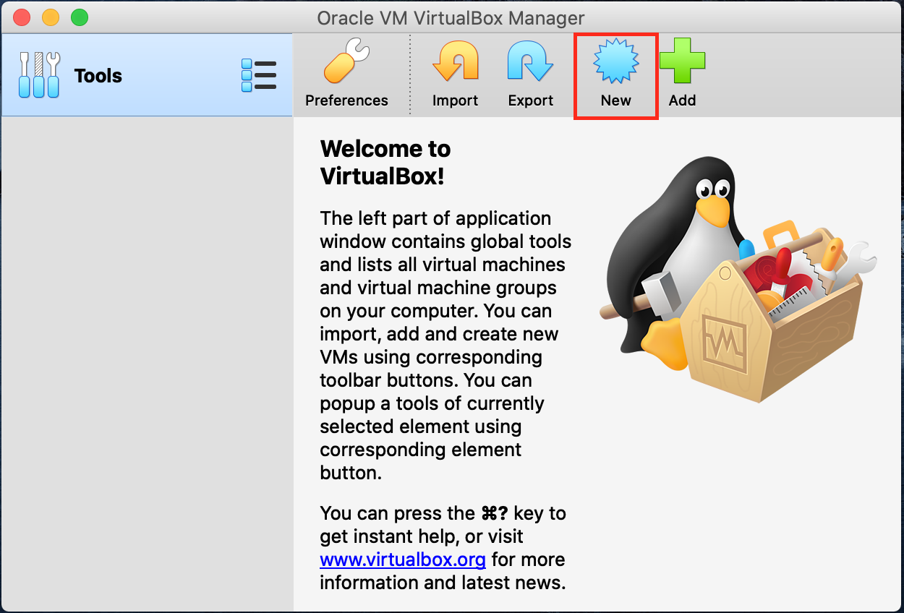
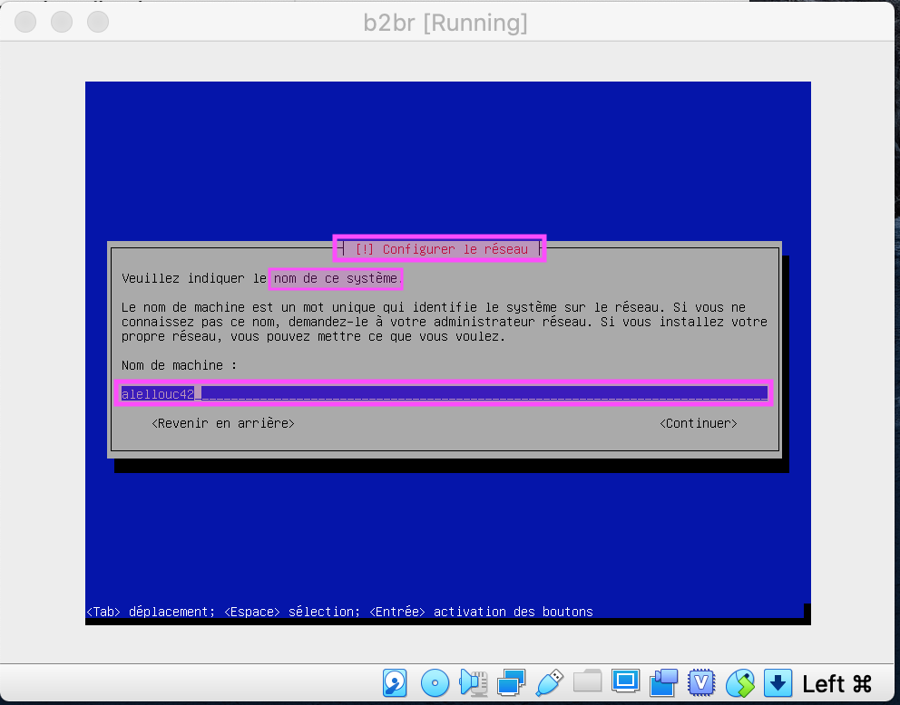
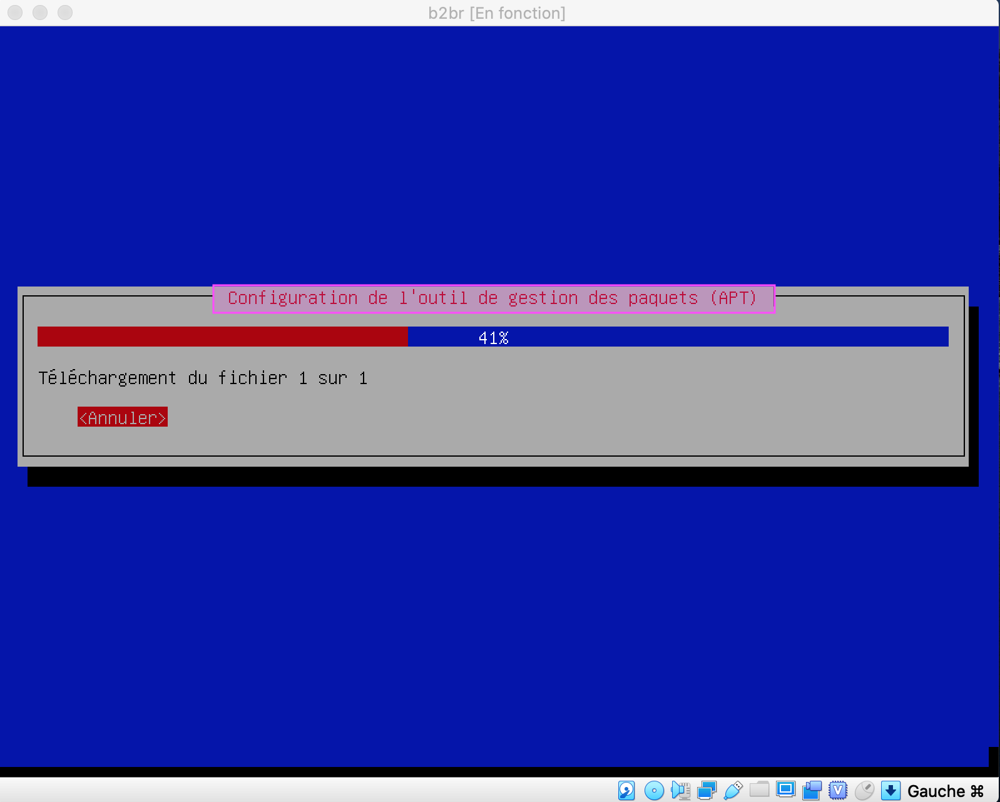
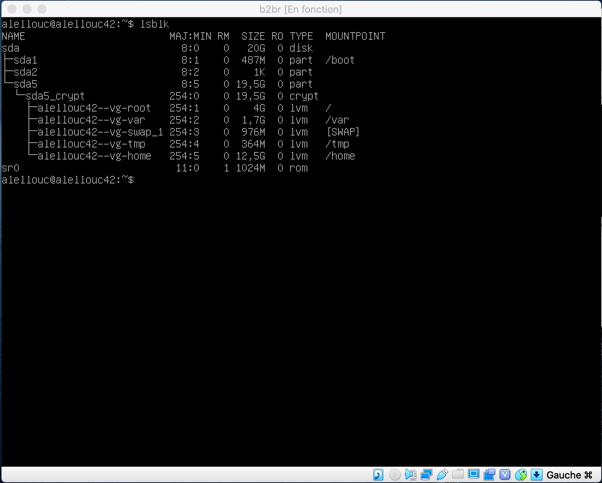

Installation de la Machine virtuelle avec Virtual Box sur Mac OSX
=================================================================

Téléchargement et installation de Virtual Box:
----------------------------------------------
- Via le MSC de 42
- Via le site de Oracle : [Virtual Box](https://www.virtualbox.org/wiki/Download_Old_Builds_6_0)

Téléchargement de l'iso de l'OS (à placer dans l'emplacement de son choix):
---------------------------------------------------------------------------
- Debian (verifier que la version soit la plus récente et stable) [Debian iso](https://www.debian.org/index.fr.html)
- CentOS (verifier que la version soit la plus récente et stable) [CentOS](https://www.centos.org/download/)

Lancement de l'application Virtual Box et création de la nouvelle vm.
---------------------------------------------------------------------
- On clique sur **New**, représenté par l'étoile bleue  en haut à droite.  

- Une fenêtre s'ouvre afin que l'on choisisse l'emplacement de la future machine virtuelle (soit ~/goinfre, soit sur un disque dur externe - pratique si comme moi, on n'est qu'à mi-temps à l'école pour pouvoir bosser sur le projet chez soi.
*Update : travailler avec une machine installée sur un disque dur aura été un calvaire, et c'est une vraie fausse bonne idée. Je n'ai rencontré que des soucis, qui m'ont fait perdre beaucoup de temps pour rien, notamment pour tout ce qui concerne la partie ssh du projet, je ne parle même pas de la fois où le Mac de l'école m'éjectait le disque dur externe toutes les 5 minutes. Cela aura été plus rapide de travailler sur 2 machines séparées (une à l'école, installée sur le goinfre, et une à la maison), qu'au travers d'un disque dur.*
- On donne le nom que l'on souhaite à la machine, on choisit l'emplacement, et on renseigne les paramètres de la machine hébergeant la vm.  

- On choisit le montant de la RAM qu'on décider d'allouer à la vm.  

- On demande la création d'un disque dur virtuel. 

- On choisit le type de fichiers que l'on compte utiliser pour la vm. Ici, on choisit **vdi** (VirtualBox Disk Image), par rapport à l'attendu du projet.  

- Ensuite on choisit si on stocke les données dynamiquement, ainsi on n'alloue que la place qu'elles occupent.  

- On indique l'endroit où on stockera le fichier .vdi de la machine, ainsi que la taille maximale de stockage autorisée sur la vm.  

- La machine est créée, bientôt on pourra la démarrer avec **Start**. L'option **Settings** permet de revenir sur les différentes configurations abordées dans cette partie; **Remove** supprime la machine virtuelle; **Clone** permet de cloner la machine virtuelle, ce sera utile lors de la correction.  

Configuration de l'OS
---------------------
Il manque encore un élément essentiel au bon fonctionnement de notre machine : il faut lui donner l'emplacement de l'image iso de l'OS qu'on a choisi d'installer dessus.  
Il faut se rendre dans les **Settings** de la machine, onglet **Storage**. Sous le panneau **Storage devices** sur la gauche, choisir **Empty**, puis sur la droite, cliquer sur l'icône disque et sur l'option **Choose Virtual Optical Disk File**.  

On pourra se rendre à l'emplacement de l'iso pour sélectionner l'image de l'OS.

On voit ici, que l'image a bien été chargée, on va pouvoir démarrer la machine virtuelle.
### Réseau

Un point que j'ai découvert, en plein milieu de la configuration ssh : la connexion doit se faire "par pont" (bridge), sinon il sera impossible de se connecter en ssh via le terminal iTerm2 installé sur sa machine Mac vers la machine virtuelle *(en revanche aucun souci dans la console de la vm, pour se connecter en ssh - mais ce n'est pas ce que l'on souhaite)*. Ce réglage se fait sur le panneau de configuration de Virtual Box

Autre élément crucial qu'on ne peut gérer que par le panneau de configuration de VirtaulBox : Il faut décocher la case UEFI (en tout cas, si on est sur MacOS 10.15 et moins) sans quoi on se retrouve avec l'erreur ci-dessous :

Où décocher UEFI :

Voici une représentation des étapes qui nous attendent pour configurer l'OS Debian 10:

Démarrage de l'Installation : Suivre les étapes sur les prochaines images, se laisser guider, l'installation est relativement simple en comparaison de ce qui nous attend pour la suite du projet.

Mon clavier se bloque après cette étape ; choses que j'ai essayé pour débloquer :
+ Augmentation a 128mo de la mémoire graphique (de toute façon, ça ne fait pas de
mal).
+ Installation du pack extension de virtual box (oui, mais à l'école ?)
+ Enregistrer l'état de la vm, puis quitter virtual box, puis relancer vb + vm.  
C'est cette dernière solution qui fonctionne, je retrouve le focus sur la saisie
et je peux poursuivre l'installation.  

1er démarrage
-------------

